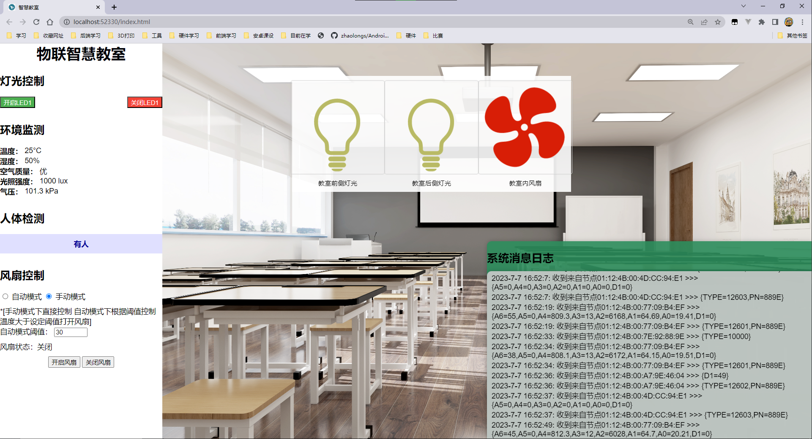

# 基于中智讯平台的物联智慧教室

## 项目展示

实现了传感器数据节点展示 阈值控制 消息日志

## 实现步骤

##### 现有资源

传感器A

大气压 空气质量 温度湿度 光照强度

传感器B

风扇 LDE1 LDE2

传感器C

人体红外

##### 项目分析

智慧教室

教室信息 传感器A 的信息 大气压 空气质量 温湿度 人体红外

LED1-2直接是控制的

风扇是阈值控制 根据温度 温度阈值设置

